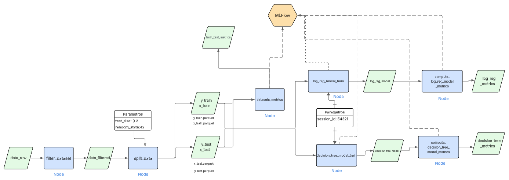
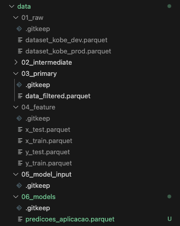
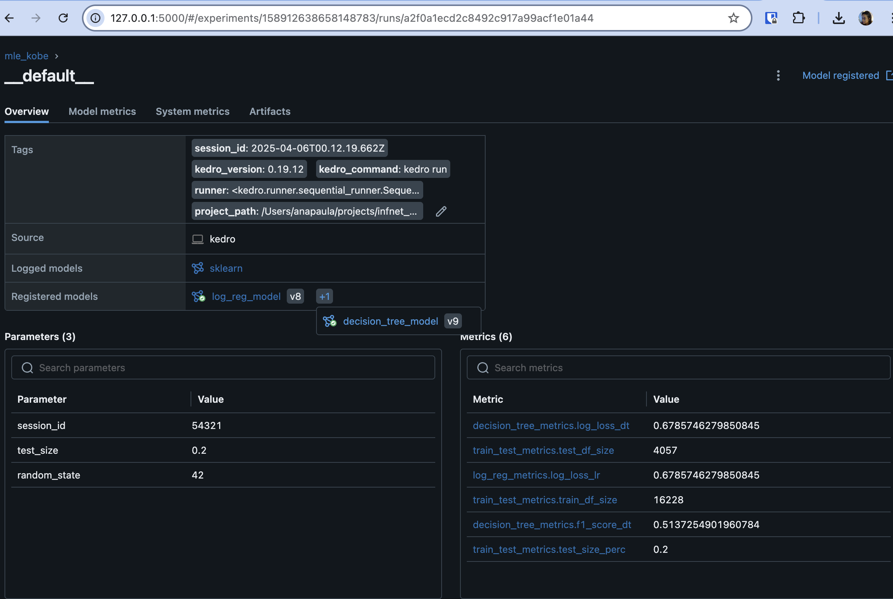
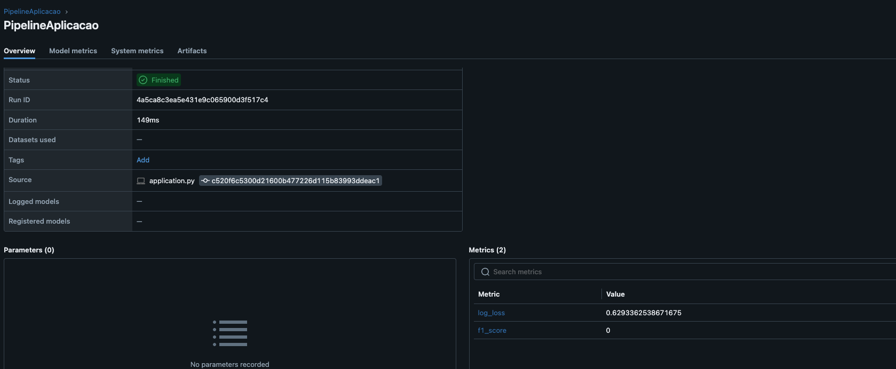
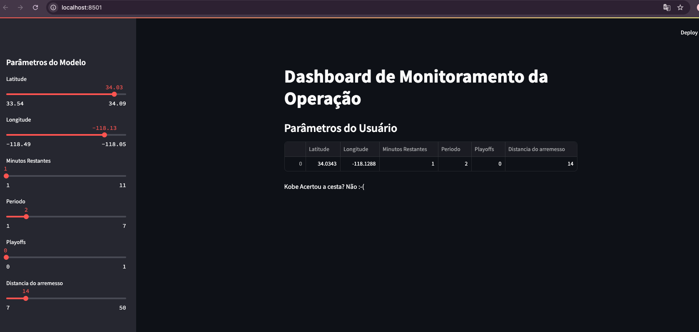

# Projeto Final MLE
Aqui temos o readme do projeto e o link este mesmo readme no github: https://github.com/ana-delfino/infnet_mle

### Índice
- [Configuração do ambiente](#configuracao-do-ambiente)
- [Desenvolvimento](#desenvolvimento)
- [Pipelines](#pipelines)
  - [Preparação de Dados](#pipelinepreparacao)
  - [Treinamento](#pipelinetreinamento)
- [Streamlit](#streamlit)

<h2 id="configuracao-do-ambiente">Configuração do ambiente </h2>

Para configurar o ambiente no terminal projeto siga as intruções abaixo:
- 1: Criar um ambiente virtual com python 3.9.21 : 
  ```
  pyenv virtualenv 3.9.21 .venv
  ```
- 2: Ative o ambiente :
  ```
  pyenv activate .venv
  ```
- 3: Instale o kedro no ambiente virtual
  ```
  pip install kedro
  ```
- 4: Crie o projeto kedro mle-kobe
  ```
  kedro new -n mle-kobe -t docs,data --example=n --telemetry=no
  ```
- 5: Mova os arquivos do folder mle-kobe para o folder principal
  ```
  mv mle-kobe/* .
  ``` 
- 6: Remova o folder mle-kobe
  ```
  rm -rf mle-kobe
  ``` 
- 7: Renomear requirements.txt para requirements.in
  ```
  mv requirements.txt requirements.in
  ``` 
- 8: Adicionar dependencias ao requirements.in.
Deve ficar assim:
  ```
  ipython>=8.10
  jupyterlab>=3.0
  kedro~=0.19.11
  kedro-datasets[pandas]
  notebook
  pyarrow
  mlflow<2.13
  pycaret[models,mlops]
  scikit-optimize
  kedro-mlflow
  streamlit
  ```
- 10: Instalar pip-tools e resolver as dependências
  ```
  pip install pip-tools
  pip-compile
  ```
- 11: Instalar as dependencias:
  ```
  pip-sync
  ```

<h2 id="desenvolvimento">Desenvolvimento</h2>

Iremos desenvolver um preditor de arremessos usando duas abordagens (regressão logística e classificação) para prever se o "Black Mamba" (apelido de Kobe) acertou ou errou a cesta.Baixe os dados de desenvolvimento e produção aqui (datasets: dataset_kobe_dev.parquet e dataset_kobe_prod.parquet). Salve-os numa pasta /data/raw na raiz do seu repositório. Para começar o desenvolvimento, desenhe um diagrama que demonstra todas as etapas necessárias para esse projeto, desde a aquisição de dados, passando pela criação dos modelos, indo até a operação do modelo.



#### 3

Como as ferramentas Streamlit, MLFlow, PyCaret e Scikit-Learn auxiliam na construção dos pipelines descritos anteriormente? A resposta deve abranger os seguintes aspectos:
- Rastreamento de experimentos;
- Funções de treinamento;
- Monitoramento da saúde do modelo;
- Atualização de modelo;
- Provisionamento (Deployment).
  
`Resposta`: As ferramentas Streamlit, MLflow, PyCaret e Scikit-Learn são extremamente valiosas na construção de pipelines de machine learning, cada uma contribuindo em diferentes etapas do processo. Elas auxiliam no rastreamento de experimentos, treinamento de modelos, monitoramento de performance, atualização e implantação de modelos.

O MLflow e o PyCaret oferecem recursos robustos para rastreamento de experimentos, permitindo acompanhar versões, métricas e parâmetros dos modelos. MLflow é a principal ferramenta para rastreamento de experimentos. Ele registra automaticamente parâmetros, métricas, artefatos e versões de modelos treinados, permitindo comparações entre execuções. PyCaret, quando integrado ao MLflow, facilita ainda mais esse processo, realizando o log de experimentos de forma automática e transparente durante o treinamento e tuning dos modelos. Já o Scikit-Learn é amplamente utilizado por disponibilizar uma vasta gama de algoritmos de aprendizado de máquina prontos para uso,além de ferramentas para pré-processamento, validação cruzada e avaliação.

Além disso, tanto o MLflow quanto o PyCaret facilitam o monitoramento contínuo da performance do modelo e a sua atualização ao longo do tempo. Para a etapa de disponibilização, Streamlit, MLflow e PyCaret oferecem suporte à implantação em diferentes ambientes. O Streamlit, em especial, permite a criação rápida de aplicações web interativas e amigáveis. Sendo uma excelente escolha para apresentar modelos de forma acessível ao público ou a usuários não técnicos.MLflow facilita a implantação de modelos através de seu módulo mlflow models serve, que permite criar endpoints RESTful localmente ou em nuvem. E o PyCaret também oferece funcionalidades para exportação e implantação de modelos com suporte para APIs REST, Streamlit, Flask, entre outros.

<h3 id="pipelines">Pipelines</h3>

#### 4

Com base no diagrama realizado na questão 2, aponte os artefatos que serão criados ao longo de um projeto. Para cada artefato, a descrição detalhada de sua composição.

- Data raw: dataset que inclui informações sobre os arremessos de Kobe, como a distância do arremesso, posição da quadra, tempo restante, entre outros.
- Preparação de dados:
  - Filtered dataset: Nó que faz o primeiro préprocessamento dos dados filtrando os apenas as colunas selecionadas para o treinamento e predição do modelo.
  - Split Data: Separa os dados em  conjunto de treinamento e conjunto de teste, bem como o parâmetro, informando o percentual utilizado para divisão do conjunto de dados em treino teste.
  - Dataset Metrics: Calcula o size para os datasets de treino e teste e apresenta o % de teste.
- Treinamento:
  - Log_reg_model_train: Ajusta o modelo de regressão logistica utlizando os dados de treinamento.
  - Decision tree model train: Ajusta o modelo de árvore de decisão utlizando os dados de treinamento.
  - Compute log reg model metrics: Cálcula as métricas para o modelo de regressão logística
  - Compute decision tree model metrics: Cálcula as métricas para o modelo de árvore de decisão .
  
<h4 id="pipelinepreparacao">Preparação de Dados</h4>

<h4 id="pipelinetreinamento">Treinamento</h4>

#### 5

Implemente o pipeline de processamento de dados com o mlflow, rodada (run) com o nome "PreparacaoDados":
- a) Os dados devem estar localizados em "/data/raw/dataset_kobe_dev.parquet" e "/data/raw/dataset_kobe_prod.parquet". 



- b) Observe que há dados faltantes na base de dados! As linhas que possuem dados faltantes devem ser desconsideradas. Para esse exercício serão apenas consideradas as colunas: lat, lng, minutes remaining, period, playoffs, shot_distance
  
`Resposta`: O node filter_dataset da preparação de dados faz esse filtro

- c) A variável shot_made_flag será seu alvo, onde 0 indica que Kobe errou e 1 que a cesta foi realizada. O dataset resultante será armazenado na pasta "/data/processed/data_filtered.parquet". Ainda sobre essa seleção, qual a dimensão resultante do dataset?
  
`Resposta`: Dimensões do datasets:  treino 16228, teste 4057 

- d) Separe os dados em treino (80%) e teste (20 %) usando uma escolha aleatória e estratificada. Armazene os datasets resultantes em "/Data/processed/base_{train|test}.parquet . Explique como a escolha de treino e teste afetam o resultado do modelo final. Quais estratégias ajudam a minimizar os efeitos de viés de dados.

`Resposta`:  A forma como os dados são divididos entre os conjuntos de treinamento e teste influencia diretamente o desempenho do modelo. Ao separar os dados, o modelo é treinado com uma parte do conjunto e avaliado com outra. Se essa divisão for inadequada, há risco de o modelo sofrer overfitting (quando se ajusta demais aos dados de treino) ou underfitting (quando não aprende o suficiente), prejudicando sua performance em dados novos.

Uma abordagem eficaz para reduzir esse tipo de viés é a validação cruzada. Essa técnica permite que o modelo seja treinado e testado em diferentes subconjuntos dos dados, o que resulta em uma avaliação mais robusta e confiável. Existem diversos tipos de validação cruzada, como K-fold e Leave-One-Out, entre outros.

Outra prática recomendada é a amostragem estratificada, que garante que a proporção das classes seja mantida tanto no conjunto de treino quanto no de teste. Isso é especialmente importante em problemas de classificação, pois evita o desequilíbrio entre os conjuntos.

A proporção entre os dados de treino e teste também deve ser escolhida com cuidado. Uma divisão comum é 80/20 ou 70/30, mas isso pode variar dependendo do tamanho do dataset e da complexidade do problema. Além disso, a seleção dos dados deve ser feita de forma aleatória. Divisões não aleatórias podem introduzir viés e afetar a capacidade do modelo de generalizar para novos exemplos.

Em resumo, a definição dos conjuntos de treinamento e teste é uma etapa crucial no desenvolvimento de modelos preditivos. O uso de validação cruzada, amostragem estratificada e divisões aleatórias ajuda a minimizar viés e contribui para a construção de modelos mais precisos e generalizáveis.

- e) Registre os parâmetros (% teste) e métricas (tamanho de cada base) no MlFlow



#### 6
Implementar o pipeline de treinamento do modelo com o MlFlow usando o nome "Treinamento"
  - a) Com os dados separados para treinamento, treine um modelo com regressão logística do sklearn usando a biblioteca pyCaret.
  - b) Registre a função custo "log loss" usando a base de teste
  - c) Com os dados separados para treinamento, treine um modelo de árvore de decisão do sklearn usando a biblioteca pyCaret.
  - d) Registre a função custo "log loss" e F1_score para o modelo de árvore.
  - e) Selecione um dos dois modelos para finalização e justifique sua escolha.

`Resposta:` O modelo decision tree foi escolhido devido ao f1 score e por sem um modelo de fácil explicabilidade.

#### 7
Registre o modelo de classificação e o sirva através do MLFlow (ou como uma API local, ou embarcando o modelo na aplicação). Desenvolva um pipeline de aplicação (aplicacao.py) para carregar a base de produção (/data/raw/dataset_kobe_prod.parquet) e aplicar o modelo. Nomeie a rodada (run) do mlflow como “PipelineAplicacao” e publique, tanto uma tabela com os resultados obtidos (artefato como .parquet), quanto log as métricas do novo log loss e f1_score do modelo.

`Resposta:`  desenvolvido em streamlit/applicacao.py



- a) O modelo é aderente a essa nova base? O que mudou entre uma base e outra? Justifique.

`Resposta:` Não, vemos queda no log loss e um f1 score de zero mostrando que o modelo não é generalizado para os dados de produção.

- b) Descreva como podemos monitorar a saúde do modelo no cenário com e sem a disponibilidade da variável resposta para o modelo em operação.

`Resposta:` Em um cenário em que a variável resposta está disponível, podemos monitorar a saúde do modelo por meio da análise de 
suas métricas de desempenho, como a função de perda log loss e o F1-Score. Essas métricas nos dão uma medida objetiva do quão bem o modelo está se saindo na tarefa de classificação.
Por exemplo, se o log loss e F1 estiverem baixos e estáveis ao longo do tempo, isso indica que o modelo está funcionando bem e é capaz de fazer previsões precisas com base nos dados disponíveis. Se houver uma queda repentina no desempenho do modelo, isso pode indicar que há um problema com a qualidade dos dados de entrada ou que o modelo precisa de ajustes. No entanto, em um cenário em que a variável resposta não está disponível, pode ser mais difícil monitorar a saúde do modelo. Nesse caso, pode ser necessário recorrer a outras técnicas, como a validação cruzada ou a análise de sensibilidade, para avaliar a capacidade do modelo de generalização para novos dados.

- c) Descreva as estratégias reativa e preditiva de retreinamento para o modelo em operação.

`Resposta:` As estratégias de retreinamento para modelos em operação podem ser classificadas em duas categorias principais: *reativa* e *preditiva*.
A estratégia reativa de retreinamento envolve monitorar as métricas de desempenho do modelo em tempo real e acionar o processo de retreinamento quando as métricas de desempenho começam a cair abaixo de um determinado limiar. Por exemplo, se o modelo começar a fazer previsões imprecisas ou inconsistentes, a estratégia reativa pode acionar um
processo de retreinamento para tentar melhorar o desempenho do modelo. Essa abordagem pode ser útil em situações em que o ambiente operacional é estável e as mudanças nos dados de entrada são relativamente previsíveis. Por outras palavras, a estratégia reativa espera o modelo começar a errar para só então iniciar o processo de retreinamento do
modelo.

Já a estratégia preditiva de retreinamento envolve a realização de retreinamento periódico do modelo com base em previsões futuras. Essa abordagem envolve o uso de técnicas de previsão para estimar quando o desempenho do modelo começará a cair e programar o retreinamento com antecedência. Por exemplo, se os dados de entrada apresentam
variações sazonais, o modelo pode ser retreinado antes do início de cada temporada para garantir que esteja preparado para lidar com os novos dados. Essa abordagem pode ser útil em ambientes operacionais dinâmicos, onde as mudanças nos dados de entrada são imprevisíveis.

Ambas as estratégias podem ser complementares e podem ser usadas em conjunto para garantir que o modelo esteja sempre atualizado e pronto para lidar com novos dados. A escolha da estratégia mais adequada dependerá das características do ambiente operacional e dos requisitos do modelo.

<h3 id="streamlit">Streamlit</h3>

#### 8

Implemente um dashboard de monitoramento da operação usando Streamlit.

